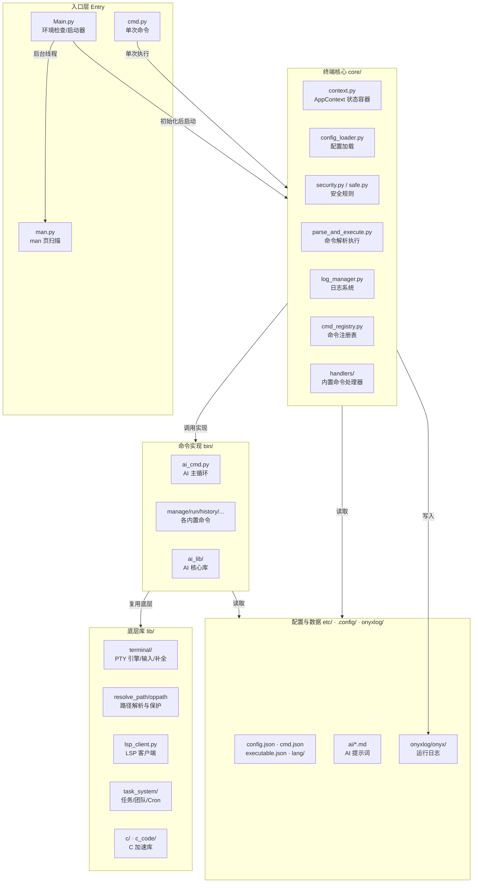
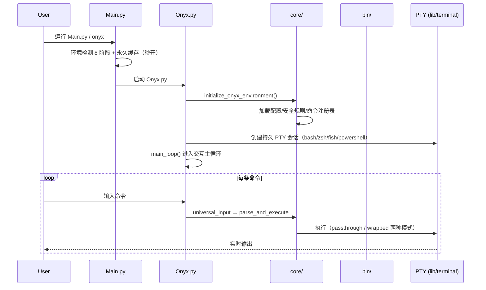
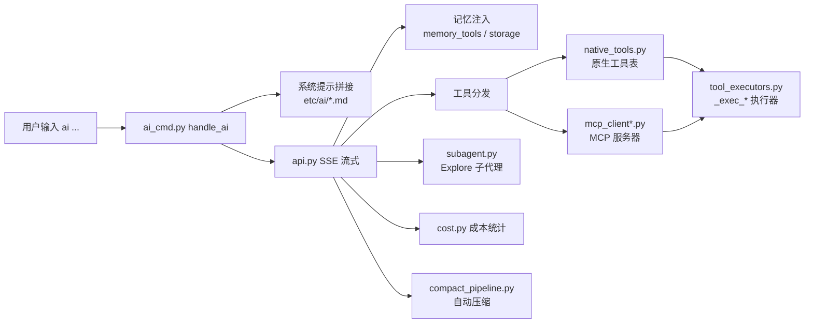
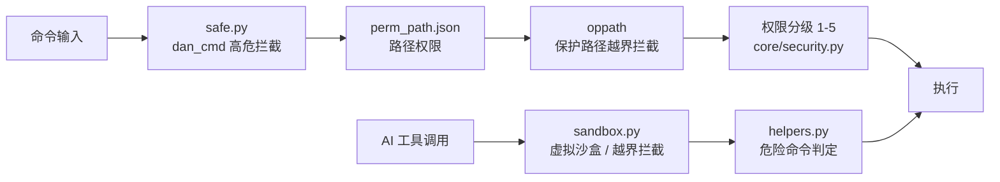

# Onyx Architecture / Onyx 架构

> **A native shell environment where humans and AI share the same secure execution layer.**
> **一个让人类和 AI 共享同一安全执行层的新一代 Shell。**
>
> This document is the authoritative map of the Onyx codebase — every top-level file,
> directory, and documentation file and what it is responsible for.
> 本文档是 Onyx 代码库的权威地图——每个顶层文件、目录、文档文件各自负责什么。

- **License / 许可**: MIT (see [LICENSE](LICENSE))
- **Language / 语言**: Python 3.8+ (plus C libraries under `lib/c_code/`)
- **Platform / 平台**: Linux · macOS · Termux

---

## 1. What Is Onyx / Onyx 是什么

```
Traditional:        Terminal → Shell (bash) → Kernel
Other "AI shells":  Terminal → Shell → AI tool-calling wrapper

Onyx:  Onyx (Input + Parse + Security + AI) → PTY → bash → Kernel
       ↑ All four layers live in the same process ↑
```

Onyx 是一个把「终端模拟器 + Shell + 安全层 + AI Agent」合并进同一个进程的终端环境：
Onyx is a terminal environment that merges "terminal emulator + shell + security layer + AI agent"
into a single process. 人类和 AI 共用同一条 PTY 会话与同一套安全策略（权限分级、路径保护、高危拦截）。

---

## 2. Architecture Overview / 架构总览



---

## 3. Startup Flow / 启动流程



- `Main.py` — 环境检查器与启动器（首启向导、`-l` 登录、`-c` 单命令、`--skip-check` 等），完成后跳转 `Onyx.py`
- `Onyx.py` — 终端主程序：`initialize_onyx_environment()` + `main_loop()`，兼容 `from Onyx import ...`
- `cmd.py` — 一次性命令模式（`-c <cmd>`），复用完整安全逻辑
- `man.py` — 后台异步扫描 man 页，写 `~/.cache/onyx/onyx/command.json`，不阻塞主程序

---

## 4. Directory Map / 目录地图

| Path / 路径 | Responsibility / 职责 |
|---|---|
| `Main.py` | 启动器：环境检测、首启向导、缓存（2209 行）Launcher: env check, first-run wizard, caching |
| `Onyx.py` | 终端主程序：初始化 + 交互主循环 + 内置 handler（3800 行）Main program: init + main loop |
| `cmd.py` | 单次命令模式 `-c` One-shot command mode |
| `man.py` | man 页后台扫描器 Async man-page scanner |
| `core/` | 终端核心层：状态、配置、安全、命令注册、日志、显示（从 Onyx.py 提取）Core layer extracted from Onyx.py |
| `core/context.py` | `AppContext` 统一状态容器（dataclass 单例，替代模块级全局变量）Unified state container |
| `core/bootstrap.py` | 引导初始化：sado 配置、管理员密码、工具别名 Bootstrap init |
| `core/cmd_registry.py` | 内置命令注册表（延迟导入防循环依赖）Builtin command registry |
| `core/config_loader.py` | 加载 config.json/executable.json/cmdal.json → AppContext Config loading |
| `core/display.py` | prompt 渲染（FormattedText / HTML 两种）、欢迎界面 Prompt rendering |
| `core/log_manager.py` | 日志子系统：分级写入、安全日志、50MB 轮转 Logging subsystem |
| `core/security.py` | 高危命令拦截（dan_cmd）、工具权限分级 1-5、沙箱校验 Security checks |
| `core/tool_registry.py` | 工具系统已移除，保留空壳兼容旧引用 Legacy stub only |
| `core/i18n.py` | 双语管理：从 `etc/lang/*.json` 展平加载，`t("key")` 查询 i18n |
| `core/path_ops.py` | 路径解析、虚拟↔物理路径转换、超长路径缩写 Path operations |
| `core/shutdown.py` | 优雅关闭：保存缓存、清理进程、恢复终端 Graceful shutdown |
| `core/handlers/` | 内置命令处理器：`builtins.py` / `cd_handler.py` / `adv_pwd_handler.py` Builtin handlers |
| `bin/` | 各内置命令实现（AI 命令体系 + 其余命令）Command implementations |
| `bin/ai_cmd.py` | **AI 主循环 `handle_ai`**（3236 行）：提示词拼接、SSE 流式、工具分发、记忆注入、子代理桥 Main AI loop |
| `bin/ai_interactive.py` | AI 独立对话 REPL（`/` 斜杠命令、多轮历史）Standalone AI chat REPL |
| `bin/ai_lib/` | **AI 核心库**（模块化拆分产物，见 §5）AI core library (modular split) |
| `bin/manage.py` · `run_cmd.py` · `history_cmd.py` · `source_cmd.py` · `plugin_loader.py` | 配置管理 / 运行脚本 / 提问历史 / source 执行 / RSA 签名插件加载 Misc commands |
| `bin/mktool_cmd.py` · `plugin_compile.py` · `nanosado_cmd.py` · `sado_cmd.py` · `activite_cmd.py` · `autocmd_cmd.py` · `import_cmd.py` · `switch_prompt_cmd.py` | 模板生成 / 插件编译 / 提权 / 模式切换 / 主题等命令 More commands |
| `bin/help/` · `bin/ai_bin/help.py` | help 命令实现 / AI 帮助 AI help |
| `lib/` | 底层可复用库（命令解析、路径、安全、终端、LSP、任务系统）Low-level reusable libraries |
| `lib/parse.py` | 命令解析与展开（引号/变量/通配符），不含执行 Command parsing only |
| `lib/parse_and_execute.py` | 执行入口：展开→分类→安全检查→执行→CWD 同步 Execution entry point |
| `lib/resolve_path.py` | 路径解析（虚拟根映射、C 库加速、越界拦截）Path resolution w/ C acceleration |
| `lib/oppath.py` | 路径保护系统：主目录内合法、越界拦截 Protected path system |
| `lib/safe.py` | 安全规则引擎：模式权限、perm_path.json、dan_cmd、验证码确认 Safety rule engine |
| `lib/spring.py` | 启动问候引擎（按时段/周末随机）Startup greeting engine |
| `lib/edit_engine.py` | SEARCH/REPLACE 编辑验证引擎（validate/preview/apply + 回滚）Edit validation engine |
| `lib/lsp_client.py` | LSP 客户端（stdio JSON-RPC：诊断/悬停/定义/引用/补全）LSP client |
| `lib/task_system/` | 任务系统：TaskPacket / TaskRegistry / TeamRegistry / CronRegistry Task system |
| `lib/terminal/` | 终端子系统：`exe.py`（PTY 持久 shell v9.7）、`input_lib.py`、`com.py`（补全+幽灵）、`mul_line.py`、`kb.py`、`colors.py` Terminal subsystem (PTY/input/completion) |
| `lib/c/` · `lib/c_code/` | 编译好的 ARM64 动态库（.so）与 C 源码（resolve_path/oppath/process_control/...）C libraries & sources |
| `lib/native_fs/panels.py` | 原生文件面板 Native file panels |
| `lib/process_control.py` · `recovery_recipes.py` · `makecache.py` · `start_banner.py` · `approval_tokens.py` | 进程控制 / 恢复配方 / 缓存 / 启动横幅 / 审批令牌 Process control & utils |
| `etc/` | 配置、命令表、语言包、AI 提示词、MCP 配置 Config & data |
| `etc/ai/` | **AI 提示词与模型配置**（见 §6 文档地图）AI prompts & model config |
| `etc/config.json` · `cmd.json` · `cmdal.json` · `executable.json` · `mapping.py` | 主配置 / 命令表 / 别名 / 可执行映射 / 命令映射 Config & command tables |
| `etc/lang/` | 语言包 `chinese.json` / `english.json` Language packs |
| `etc/mcp/mcp.json` | MCP 服务器配置 MCP server config |
| `etc/mktool/` | mktool 模板（formwork.c/cpp/py + language.json）mktool templates |
| `etc/dan_cmd` · `perm_path.json` · `spring.json` · `tips.json` · `config/` · `other_terminal_cmd.json` · `cmd/cmd_para.json` | 高危命令表 / 路径权限 / 问候语 / 提示 / 运行时配置项 / 其他终端命令 / 命令参数表 Security & runtime data |
| `test/` · `test/virtual/` | 测试脚本与虚拟环境测试套件（30+ 个用例）Tests & virtual-env test suite |
| `.onyx/skills/` | 技能文档：`builtin-commands.md`、`debug/`、`refactor/`、`task-workflow/` Skill docs |
| `onyxlog/onyx/` | 运行日志输出目录 Runtime log output |
| `.config/onyx/language` | 运行时语言设置 Runtime language setting |
| `requirements.txt` | Python 依赖清单 Python dependencies |

---

## 5. AI Subsystem / AI 子系统



### 5.1 `bin/ai_lib/` — AI 核心库模块 / AI Core Library Modules

| Module / 模块 | Responsibility / 职责 |
|---|---|
| `api.py` | SSE 流式 API 调用、结果处理、活跃响应中断 Streaming API calls |
| `config.py` | AI 配置：模型列表（etc/ai/models.json）、密钥、prompt 文本 AI config |
| `cost.py` | 成本估算（价格表→最便宜模型）+ 平台余额查询 Cost estimation |
| `memory_compact.py` | Trident 三阶段记忆压缩（Supersede→Collapse→Cluster）Memory compression engine |
| `memory_tools.py` | 记忆工具执行器（MemoryRead/Search/remember/forget/...）Memory tools |
| `native_tools.py` | 原生工具表（OpenAI function calling schema）、权限级别常量 Native tool schema |
| `subagent.py` | Explore 只读子代理（同步/异步、并发上限 5、水位线保险丝）Explore sub-agent |
| `mcp_client.py` | MCP 客户端协议 + 服务器生命周期管理 MCP client |
| `mcp_client_core.py` | MCP 核心：JSON-RPC 收发、connect/preload/health_check、工具发现 MCP core |
| `mcp_registry.py` | 线程安全 MCP 工具注册表 + schema 指纹缓存 MCP registry |
| `mcp_transport.py` | 传输层抽象（StdioTransport 子进程、HttpTransport 预留）MCP transport |
| `mcp_exec.py` | 工具执行分发器（execute_mcp_tool：内置→MCP 兜底）MCP exec dispatcher |
| `mcp_state.py` | MCP 共享可变状态集中地（防循环导入）Shared MCP state |
| `compact_pipeline.py` | 对话压缩管道（AutoCompact 与 /compact 共用）Compaction pipeline |
| `prompt_cache.py` | 统一前缀缓存管理器（保 DeepSeek 前缀命中）Prefix cache manager |
| `tool_executors.py` | 内置 `_exec_*` 执行器（文件/搜索/技能/Todo/Git/Cron/...）Builtin tool executors |
| `web_search.py` | web_search 网络调研（多查询×多引擎、SSRF 防护）Web search tool |
| `storage.py` | AI 存储：命令缓存、聊天记忆（chat json）、会话记录（library）Storage |
| `timeline.py` | 记忆时间线（time/ 树 + timeline.json 分层摘要）Memory timeline |
| `plus.py` | Onyx Plus 高级思考流水线（分析→模拟→自检→规划）Plus pipeline |
| `env_probe.py` | EnvProbe 环境探测（只读秒回）Environment probe |
| `parsers.py` | Markdown 直通处理 Markdown passthrough |
| `sandbox.py` | AI 虚拟沙盒：`/` 映射为用户 cwd、越界拦截、输出脱敏 AI sandbox |
| `cache_diagnostics.py` | 前缀缓存诊断（SHA256 快照对比）Cache diagnostics |
| `grep_utils.py` | 文件搜索核心（grep -rn，MemorySearch 与 grep_search 共用）Grep core |
| `helpers.py` | AI 辅助：sleep/计划确认/危险命令判定/参数解析 Helpers |
| `i18n.py` · `lang.py` · `lang.json` | AI 中英双语文本字典 i18n dictionary |
| `output_capture.py` | 命令输出实时捕获（ANSI 剥离 + 行数限制）Output capture |
| `py_analysis.py` | Python 内置代码分析（ast/compile 零依赖）Python analysis |
| `tool_results.py` | 工具结果处理（32KB 截断/剪枝/错误检测/token 估算）Tool result handling |
| `ui.py` | AI 终端 UI 增强（Rich+InquirerPy，缺失自动回退）UI enhancements |
| `tools/code_analysis.py` | 代码分析工具包（py_diagnostics/py_symbols/Lsp*）Code analysis toolkit |

> 注：`bin/ai_cmd.py` 曾是 405KB/8268 行的巨型文件；经模块化拆分后主文件瘦身为 3236 行，
> 其余逻辑按职责移入 `bin/ai_lib/` 各模块。这就是 2.9.2「优化 AI 架构（模块化拆分）」对应的改动。
> Note: `ai_cmd.py` used to be a 405KB/8268-line monolith; after modular refactoring the main file
> is 3236 lines and the rest moved into `bin/ai_lib/` — the change behind 2.9.2 "modular refactoring".

---

## 6. Documentation Map / 文档地图

每个 Markdown 文件管什么 / What each Markdown file is for:

| File / 文件 | Purpose / 用途 |
|---|---|
| `README.md` | 项目总览（中英双语）：定位、PTY 引擎、安全三模式、AI 管线、记忆系统、架构分层 Project overview |
| `help.md` | 内置帮助（中英双语）：快速开始、内建命令表、MCP、任务系统、安全模型 Built-in help |
| `ARCHITECTURE.md` | **本文档**：代码库地图、架构图、文件职责、文档地图 This file |
| `need.txt` | 项目内部核心规则：`ai_plugin/` 绝不开源、不做通用热插拔插件、设计原则 Internal rules |
| `LICENSE` | MIT 开源许可 (c) 2026 Jingbo Gao |
| `etc/ai/agreement.md` | AI 系统协议（行为准则，拼接进系统提示）AI system agreement |
| `etc/ai/onyx.md` | Onyx 自我认知（身份与技能，拼接进系统提示）Self-identity prompt |
| `etc/ai/self.md` | AI 自我认知提示（同上的补充层）Self-cognition prompt |
| `etc/ai/skill.md` | 技能与工具使用规范（拼接进系统提示）Skills & tool-use rules |
| `etc/ai/mood.md` | 情感/语气提示词 Mood/tone prompt |
| `etc/ai/models.json` | 模型列表与价格表（非 md，AI 配置核心）Model list & pricing |
| `.onyx/skills/builtin-commands.md` | 内置命令技能说明（Onyx 终端内置命令）Builtin commands skill |
| `.onyx/skills/debug/` · `refactor/` · `task-workflow/` | 调试 / 重构 / 任务工作流技能剧本 Debug/refactor/task-workflow skills |
| `bin/help/help_info/` | help 命令的数据源 Help command data |

---

## 7. Security Model / 安全模型



人类命令与 AI 命令走同一套安全检查链：高危命令黑名单（`etc/dan_cmd`）、路径级权限（`perm_path.json`）、
保护路径（oppath）、权限分级与验证码二次确认。AI 侧另有虚拟沙盒与输出脱敏。
Human and AI commands share the same security chain: dangerous-command blacklist, path-level
permissions, protected paths, permission tiers and captcha confirmation; the AI side additionally
has a virtual sandbox with output sanitization.

---

*Maintained by the Onyx project — update this map whenever files are moved or added.*
*由 Onyx 项目维护——文件移动或新增时请同步更新此地图。*
